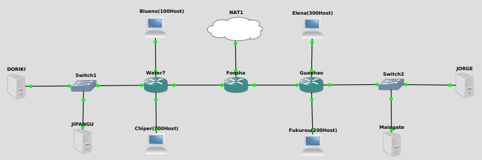

# jarkom-modul-5-C14-2021

Praktikum Jaringan Komputer Modul 5 
### Nama Anggota Kelompok:
1. 05111940000059 	Dido Fabian Fayed <br>
2. 05111940000074	Nur Ahmad Khatim <br>
3. 05111940000162	Ramadhan Arif Hardijansyah <br>

## VLSM
### Subnetting
1. Melakukan subnetting pada topologi yang diberikan. Sehingga terbentuk 8 subnet


2. Menentukan jumlah alamat IP yang dibutuhkan oleh tiap subnet dan melakukan labelling netmask berdasarkan jumlah IP yang dibutuhkan. <br>
 <br>
Berdasarkan total IP dan netmask yang dibutuhkan, maka dapat menggunakan netmask /21 untuk memberikan pengalamatan IP pada subnet.

3. Subnet besar yang dibentuk memiliki NID 10.21.0.0 dengan netmask /21. Selanjutnya menghitung pembagian IP berdasarkan NID dan netmask tersebut menggunakan pohon seperti gambar berikut. <br>
 <br>
 <br>

### A. Topologi <br>
 <br>

### B. Konfigurasi IP setiap interface sesuai pembagian subnet pada tree

#### Foosha
```
auto lo
iface lo inet loopback

auto eth0
iface eth0 inet dhcp
        address 10.21.0.10
       netmask 255.255.255.252
       gateway 10.21.0.9

auto eth1
iface eth1 inet static
        address 10.21.0.1
        netmask 255.255.255.252

auto eth2
iface eth2 inet static
         address 10.21.0.5
         netmask 255.255.255.252
```

#### Water7
```
auto eth0
iface eth0 inet static
        address 10.21.0.2
        netmask 255.255.255.252
        gateway 10.21.0.1

auto eth1
iface eth1 inet static
        address 10.21.0.17
        netmask 255.255.255.248

auto eth2
iface eth2 inet static
         address 10.21.0.129
         netmask 255.255.255.128

auto eth3
iface eth3 inet static
         address 10.21.4.1
         netmask 255.255.252.0
```

#### Guanhao
```
auto eth0
iface eth0 inet static
          address 10.21.0.6
          netmask 255.255.255.252
          gateway 10.21.0.5

auto eth1
iface eth1 inet static
          address 10.21.0.25
          netmask 255.255.255.248

auto eth2
iface eth2 inet static
          address 10.21.1.1
          netmask 255.255.255.0

auto eth3
iface eth3 inet static
           address 10.21.2.1
          netmask 255.255.254.0
```

#### Blueno
```
#auto eth0
#iface eth0 inet static
      address 10.21.0.130
      netmask 255.255.255.128
      gateway 10.21.0.129

auto eth0
iface eth0 inet dhcp
```

#### Chiper
```
#auto eth0
#iface eth0 inet static
      address 10.21.4.2
      netmask 255.255.252.0
      gateway 10.21.4.1

auto eth0
iface eth0 inet dhcp
```

#### Elena
```
auto eth0
iface eth0 inet static
       address 10.21.2.2
       netmask 255.255.254.0
       gateway 10.21.2.1

#auto eth0
#iface eth0 inet dhcp
```

#### Fukurou
```
#auto eth0
#iface eth0 inet static
       address 10.21.1.2
       netmask 255.255.255.0
       gateway 10.21.1.1

auto eth0
iface eth0 inet dhcp
```

#### Maingate
```
auto eth0
iface eth0 inet static
       address 10.21.0.27
       netmask 255.255.255.248
       gateway 10.21.0.25
```

#### Jorge
```
auto eth0
iface eth0 inet static
       address 10.21.0.26
       netmask 255.255.255.248
       gateway 10.21.0.25
```

#### Doriki
```
auto eth0
iface eth0 inet static
       address 10.21.0.18
       netmask 255.255.255.248
       gateway 10.21.0.17
```

#### Jipangu
```
auto eth0
iface eth0 inet static
       address 10.21.0.19
       netmask 255.255.255.248
       gateway 10.21.0.17
```

### C. Routing
#### Foosha
```
route add -net 10.21.1.0 netmask 255.255.255.0 gw 10.21.0.6
route add -net 10.21.2.0 netmask 255.255.254.0 gw 10.21.0.6
route add -net 10.21.0.24 netmask 255.255.255.248 gw 10.21.0.6
route add -net 10.21.4.0 netmask 255.255.252.0 gw 10.21.0.2
route add -net 10.21.0.128 netmask 255.255.255.128 gw 10.21.0.2
route add -net 10.21.0.16 netmask 255.255.255.248 gw 10.21.0.2
```

### D. Tetapkan IP ke subnet Blueno, Cipher, Fukurou, dan Elena secara dinamis menggunakan bantuan DHCP server. Kemudian ingat bahwa harus diatur DHCP Relay pada router yang menghubungkannya.

## 1. Agar topologi yang kalian buat dapat mengakses keluar, kalian diminta untuk mengkonfigurasi Foosha menggunakan iptables, tetapi Luffy tidak ingin menggunakan MASQUERADE.
<b> Pada Foosha </b>
- Untuk menyesuaikan eth0, gunakan command 

        iptables -t nat -A POSTROUTING -s 10.21.0.0/16 -o eth0 -j SNAT --to-s (ip eth0)
- Pada node yng berhubungan berikan command

        echo nameserver 10.21.122.1 > /etc/resolv.conf
<b> Dokumentasi </b>

** IP eth0 akan selalu berganti ketika restart node pada foosha atau restart GNS3 dengan rentang IP yang sudah dijelaskan

** `ip a` pada Foosha untuk mengetahui eth0 

## 2. Kalian diminta untuk mendrop semua akses HTTP dari luar Topologi kalian pada server yang memiliki ip DHCP dan DNS Server demi menjaga keamanan.
- Untuk menyelesaikan case ini gunakan command  

        iptables -A FORWARD -p tcp --dport 80 -d 10.21.0.16/29 -i eth0 -j DROP
<b> Testing </b>

- `apt-get install netcat` --> Install netcat di server **Jipangu** dan **Doriki**
- Pada **Jipangu** dan **Doriki** ketikkan: `nc -l -p 80`
- Pada **foosha** ketikkan: `nmap -p 80 10.21.0.19` atau `nmap -p 80 10.21.0.18`


## 3. Karena kelompok kalian maksimal terdiri dari 3 orang. Luffy meminta kalian untuk membatasi DHCP dan DNS Server hanya boleh menerima maksimal 3 koneksi ICMP secara bersamaan menggunakan iptables, selebihnya didrop.
<b> Doriki </b>
- Command :

        iptables -A INPUT -m state --state ESTABLISHED,RELATED -j ACCEPT
        iptables -A INPUT -p icmp -m connlimit --connlimit-above 3 --connlimit-mask 0 -j DROP
        
- Untuk mengecek bisa dilakukan dengan masuk ke 4 node berbeda.
- Ping ke arah Jipangu secara bersamaan.

<b> Dokumentasi </b>
- Maingate

- Guanhou

- Jorge

- Elena

## 4. Kemudian kalian diminta untuk membatasi akses ke Doriki yang berasal dari subnet Blueno, Cipher, Elena dan Fukuro dengan beraturan sebagai berikut :Akses dari subnet Blueno dan Cipher hanya diperbolehkan pada pukul 07.00 - 15.00 pada hari Senin sampai Kamis.
<b> Pada Doriki </b>
- Untuk paket yang berasal dari **Blueno** dengan command:
        
        iptables -A INPUT -s 10.21.0.128/25 -m time --timestart 07:00 --timestop 15:00 --weekdays Mon,Tue,Wed,Thu -j ACCEPT
        iptables -A INPUT -s 10.21.0.128/25 -j REJECT

- Gunakan command berikut untuk paket yang berasal dari **Chiper** :

        iptables -A INPUT -s 10.21.4.0/22 -m time --timestart 07:00 --timestop 15:00 --weekdays Mon,Tue,Wed,Thu -j ACCEPT
        iptables -A INPUT -s 10.21.4.0/22 -j REJECT
        
<b> Testing </b>


## 5.   Akses dari subnet Elena dan Fukuro hanya diperbolehkan pada pukul 15.01 hingga pukul 06.59 setiap harinya.Selain itu di reject.
<b> Pada Doriki </b>
- Command yang digunakan 

        iptables -A INPUT -s 10.21.2.0/23 -m time --timestart 07:00 --timestop 15:00 -j REJECT
<b> Pada Fukorou </b>
- Command yang digunakan 

        iptables -A INPUT -s 10.21.1.0/24 -m time --timestart 07:00 --timestop 15:00 -j REJECT
        
 <b> Testing </b>
 - Fukurou
        gambar
 - Elena
        gambar

## 6.   Karena kita memiliki 2 Web Server, Luffy ingin Guanhao disetting sehingga setiap request dari client yang mengakses DNS Server akan didistribusikan secara bergantian pada Jorge dan Maingate
<b> Pada Doriki </b>
- Create domain (DNS) yang mengarah ke IP random (cth: 10.21.8.1) pada file `/etc/bind/named.conf`
        
        zone "jarkomC05.com" {
        type master;
        file "/etc/bind/jarkom/jarkomC05.com";};

- Create `jarkom` folder 
        
        mkdir /etc/bind/jarkom
- Copy  `db.local` ke dalam file  `/etc/bind/jarkom/jarkomC05.com ` mengguanakan command:
        
        cp /etc/bind/db.local /etc/bind/jarkom/jarkomC05.com       
        
- Edit file `/etc/bind/jarkom/jarkomC05.com`

        $TTL    604800
        @       IN      SOA     jarkomC05.com. root.jarkomC05.com. (
                                2021120705      ; Serial
                                 604800         ; Refresh
                                  86400         ; Retry
                                2419200         ; Expire
                                 604800 )       ; Negative Cache TTL
        ;
        @       IN      NS      jarkomC05.com.
        @       IN      A       10.21.8.1
 
<b> Pada Guanhou </b>

        iptables -A PREROUTING -t nat -p tcp -d 10.21.8.1 --dport 80 -m statistic --mode nth --every 2 --packet 0 -j DNAT --to-destination 10.21.0.26:80
        iptables -A PREROUTING -t nat -p tcp -d 10.21.8.1 --dport 80 -j DNAT --to-destination 10.21.0.27:80
        iptables -t nat -A POSTROUTING -p tcp -d 10.21.0.26 --dport 80 -j SNAT --to-source 10.21.8.1:80
        iptables -t nat -A POSTROUTING -p tcp -d 10.21.0.27 --dport 80 -j SNAT --to-source 10.21.8.1:80
        
<b> Testing </b>

a.  Install `apt-get install netcat` di **Guanhao, Jorge, Maingate Elena dan Fukurou**

b.  Command ` nc -l -p 80` pada **Jorge**

c.  Command `nc -l -p 80` pada **Maingate**

d.  Command `nc 10.21.8.1 80` pada **Elena** dan **Fukurou**

e.  Masukkan random input pada **Elena** dan **Fukurou**, maka akan muncul secara bergantian 

<b> Dokumentasi Testing </b>
- Fukurou
        gambar
 - Elena
        gambar
