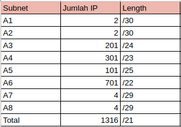
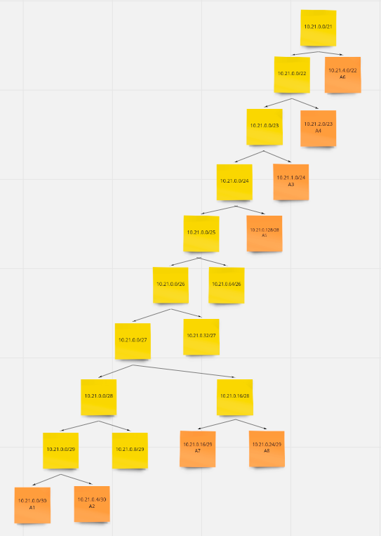
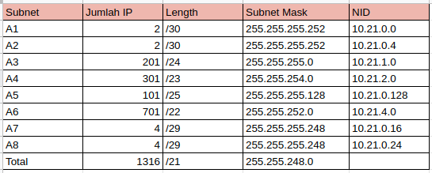

# jarkom-modul-5-C14-2021

Praktikum Jaringan Komputer Modul 5 
### Nama Anggota Kelompok:
1. 05111940000059 	Dido Fabian Fayed  
2. 05111940000074	Nur Ahmad Khatim  
3. 05111940000162	Ramadhan Arif Hardijansyah  

## VLSM
### Subnetting
1. Melakukan subnetting pada topologi yang diberikan. Sehingga terbentuk 8 subnet

2. Menentukan jumlah alamat IP yang dibutuhkan oleh tiap subnet dan melakukan labelling netmask berdasarkan jumlah IP yang dibutuhkan.  
  
Berdasarkan total IP dan netmask yang dibutuhkan, maka dapat menggunakan netmask /21 untuk memberikan pengalamatan IP pada subnet.

3. Subnet besar yang dibentuk memiliki NID 10.21.0.0 dengan netmask /21. Selanjutnya menghitung pembagian IP berdasarkan NID dan netmask tersebut menggunakan pohon seperti gambar berikut.  
  
  

