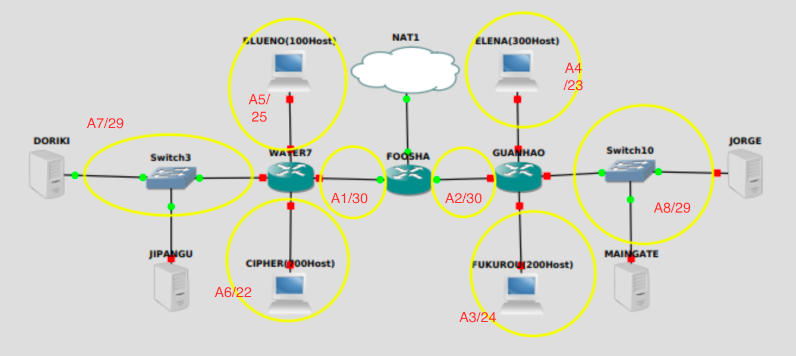

# jarkom-modul-5-C14-2021

Praktikum Jaringan Komputer Modul 5 
### Nama Anggota Kelompok:
1. 05111940000059 	Dido Fabian Fayed <br>
2. 05111940000074	Nur Ahmad Khatim <br>
3. 05111940000162	Ramadhan Arif Hardijansyah <br>

## VLSM
### Subnetting
1. Melakukan subnetting pada topologi yang diberikan. Sehingga terbentuk 8 subnet


2. Menentukan jumlah alamat IP yang dibutuhkan oleh tiap subnet dan melakukan labelling netmask berdasarkan jumlah IP yang dibutuhkan. <br>
 <br>
Berdasarkan total IP dan netmask yang dibutuhkan, maka dapat menggunakan netmask /21 untuk memberikan pengalamatan IP pada subnet.

3. Subnet besar yang dibentuk memiliki NID 10.21.0.0 dengan netmask /21. Selanjutnya menghitung pembagian IP berdasarkan NID dan netmask tersebut menggunakan pohon seperti gambar berikut. <br>
 <br>
 <br>

### A. Topologi <br>
 <br>

### B. Konfigurasi IP setiap interface sesuai pembagian subnet pada tree

#### Foosha
```
auto lo
iface lo inet loopback

auto eth0
iface eth0 inet dhcp
        address 10.21.0.10
       netmask 255.255.255.252
       gateway 10.21.0.9

auto eth1
iface eth1 inet static
        address 10.21.0.1
        netmask 255.255.255.252

auto eth2
iface eth2 inet static
         address 10.21.0.5
         netmask 255.255.255.252
```

#### Water7
```
auto eth0
iface eth0 inet static
        address 10.21.0.2
        netmask 255.255.255.252
        gateway 10.21.0.1

auto eth1
iface eth1 inet static
        address 10.21.0.17
        netmask 255.255.255.248

auto eth2
iface eth2 inet static
         address 10.21.0.129
         netmask 255.255.255.128

auto eth3
iface eth3 inet static
         address 10.21.4.1
         netmask 255.255.252.0
```

#### Guanhao
```
auto eth0
iface eth0 inet static
          address 10.21.0.6
          netmask 255.255.255.252
          gateway 10.21.0.5

auto eth1
iface eth1 inet static
          address 10.21.0.25
          netmask 255.255.255.248

auto eth2
iface eth2 inet static
          address 10.21.1.1
          netmask 255.255.255.0

auto eth3
iface eth3 inet static
           address 10.21.2.1
          netmask 255.255.254.0
```

#### Blueno
```
#auto eth0
#iface eth0 inet static
 #      address 10.21.0.130
 #      netmask 255.255.255.128
  #     gateway 10.21.0.129

auto eth0
iface eth0 inet dhcp
```

#### Chiper
```
#auto eth0
#iface eth0 inet static
#       address 10.21.4.2
#      netmask 255.255.252.0
#       gateway 10.21.4.1

auto eth0
iface eth0 inet dhcp
```

#### Elena
```
auto eth0
iface eth0 inet static
       address 10.21.2.2
       netmask 255.255.254.0
       gateway 10.21.2.1

#auto eth0
#iface eth0 inet dhcp
```

#### Fukurou
```
#auto eth0
#iface eth0 inet static
       address 10.21.1.2
       netmask 255.255.255.0
       gateway 10.21.1.1

auto eth0
iface eth0 inet dhcp
```

#### Maingate
```
auto eth0
iface eth0 inet static
       address 10.21.0.27
       netmask 255.255.255.248
       gateway 10.21.0.25
```

#### Jorge
```
auto eth0
iface eth0 inet static
       address 10.21.0.26
       netmask 255.255.255.248
       gateway 10.21.0.25
```

#### Doriki
```
auto eth0
iface eth0 inet static
       address 10.21.0.18
       netmask 255.255.255.248
       gateway 10.21.0.17
```

#### Jipangu
```
auto eth0
iface eth0 inet static
       address 10.21.0.19
       netmask 255.255.255.248
       gateway 10.21.0.17
```

### C. Routing
#### Foosha
```
route add -net 10.21.1.0 netmask 255.255.255.0 gw 10.21.0.6
route add -net 10.21.2.0 netmask 255.255.254.0 gw 10.21.0.6
route add -net 10.21.0.24 netmask 255.255.255.248 gw 10.21.0.6
route add -net 10.21.4.0 netmask 255.255.252.0 gw 10.21.0.2
route add -net 10.21.0.128 netmask 255.255.255.128 gw 10.21.0.2
route add -net 10.21.0.16 netmask 255.255.255.248 gw 10.21.0.2
```

### D. Tetapkan IP ke subnet Blueno, Cipher, Fukurou, dan Elena secara dinamis menggunakan bantuan DHCP server. Kemudian ingat bahwa harus diatur DHCP Relay pada router yang menghubungkannya.

## 1.

## 2. 

## 3. 

## 4. 

## 5.   Akses dari subnet Elena dan Fukuro hanya diperbolehkan pada pukul 15.01 hingga pukul 06.59 setiap harinya.Selain itu di reject.
<b> Pada Doriki </b>
- Command yang digunakan 

        iptables -A INPUT -s 10.21.2.0/23 -m time --timestart 07:00 --timestop 15:00 -j REJECT
<b> Pada Fukorou </b>
- Command yang digunakan 

        iptables -A INPUT -s 10.21.1.0/24 -m time --timestart 07:00 --timestop 15:00 -j REJECT
        
 <b> Testing </b>
 - Fukurou
        gambar
 - Elena
        gambar

## 6.   Karena kita memiliki 2 Web Server, Luffy ingin Guanhao disetting sehingga setiap request dari client yang mengakses DNS Server akan didistribusikan secara bergantian pada Jorge dan Maingate
<b> Pada Doriki </b>
- Create domain (DNS) yang mengarah ke IP random (cth: 10.21.8.1) pada file `/etc/bind/named.conf`
        
        zone "jarkomC05.com" {
        type master;
        file "/etc/bind/jarkom/jarkomC05.com";};

- Create `jarkom` folder 
        
        mkdir /etc/bind/jarkom
- Copy  `db.local` ke dalam file  `/etc/bind/jarkom/jarkomC05.com ` mengguanakan command:
        
        cp /etc/bind/db.local /etc/bind/jarkom/jarkomC05.com       
        
- Edit file `/etc/bind/jarkom/jarkomC05.com`

        $TTL    604800
        @       IN      SOA     jarkomC05.com. root.jarkomC05.com. (
                                2021120705      ; Serial
                                 604800         ; Refresh
                                  86400         ; Retry
                                2419200         ; Expire
                                 604800 )       ; Negative Cache TTL
        ;
        @       IN      NS      jarkomC05.com.
        @       IN      A       10.21.8.1
 
<b> Pada Guanhou </b>

        iptables -A PREROUTING -t nat -p tcp -d 10.21.8.1 --dport 80 -m statistic --mode nth --every 2 --packet 0 -j DNAT --to-destination 10.21.0.26:80
        iptables -A PREROUTING -t nat -p tcp -d 10.21.8.1 --dport 80 -j DNAT --to-destination 10.21.0.27:80
        iptables -t nat -A POSTROUTING -p tcp -d 10.21.0.26 --dport 80 -j SNAT --to-source 192.10.21.1:80
        iptables -t nat -A POSTROUTING -p tcp -d 10.21.0.27 --dport 80 -j SNAT --to-source 192.10.21.1:80
        
<b> Testing </b>

a.  Install `apt-get install netcat` di **Guanhao, Jorge, Maingate Elena dan Fukurou**

b.  Command ` nc -l -p 80` pada **Jorge**

c.  Command `nc -l -p 80` pada **Maingate**

d.  Command `nc 10.21.8.1 80` pada **Elena** dan **Fukurou**

e.  Masukkan random input pada **Elena** dan **Fukurou**, maka akan muncul secara bergantian 

<b> Dokumentasi Testing </b>
- Fukurou
        gambar
 - Elena
        gambar
